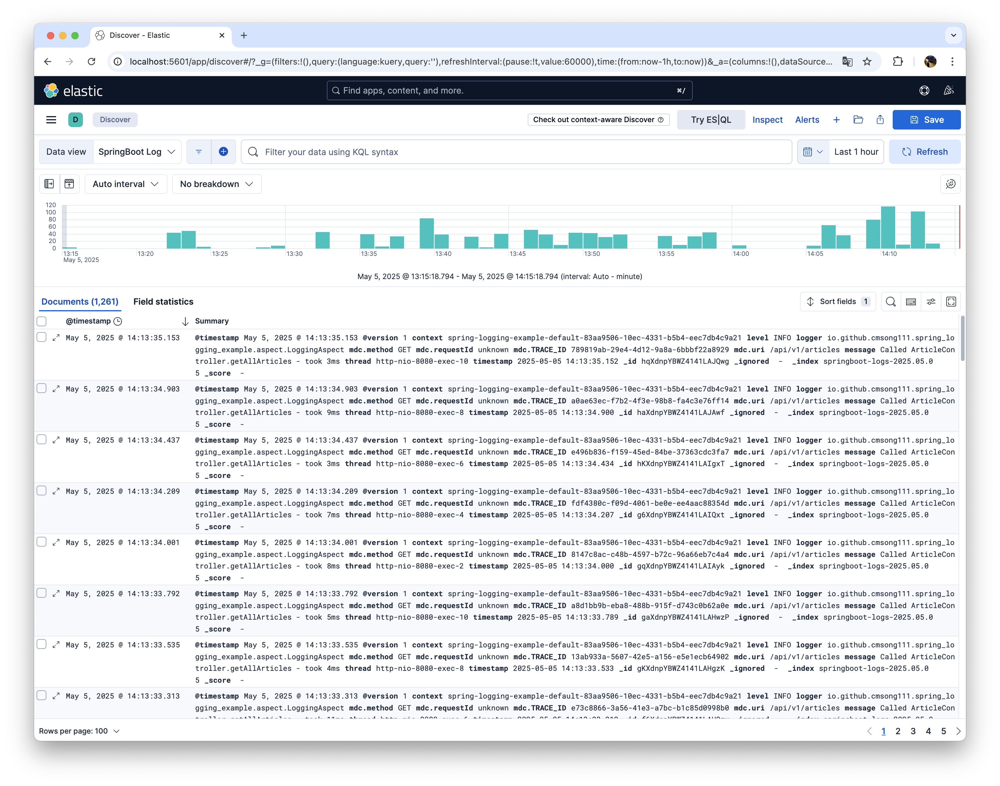
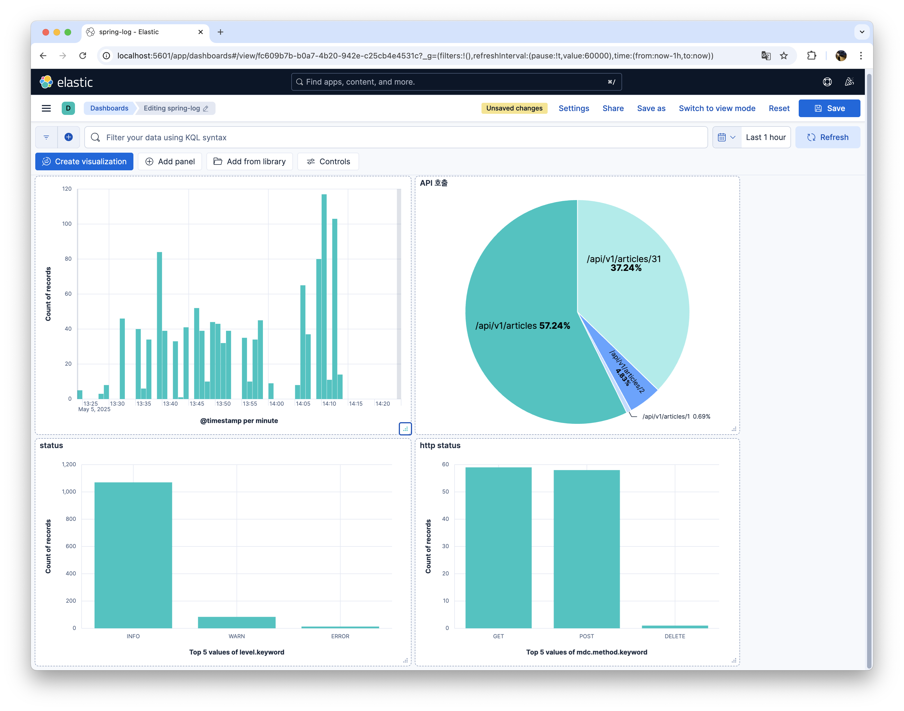

# SpringBoot ELK Logging Example

> 스프링부트에서 ELK를 활용한 로그 수집 및 분석 예제입니다.

## Set Up ELK Stack

[Docker ELK](https://github.com/deviantony/docker-elk)을 참고해서 ELK 환경을 구축합니다.

## Spring Boot

### Gradle Dependency

```groovy
dependencies {
    implementation("ch.qos.logback.contrib:logback-json-classic:0.1.5")
    implementation("ch.qos.logback.contrib:logback-jackson:0.1.5")
    implementation("com.fasterxml.jackson.core:jackson-core")
    implementation("com.fasterxml.jackson.core:jackson-databind")
    implementation("net.logstash.logback:logstash-logback-encoder:8.1")
    implementation("io.github.oshai:kotlin-logging-jvm:7.0.7")
}
```

### LogBack 설정

```xml
<?xml version="1.0" encoding="UTF-8"?>
<configuration>
    <springProperty name="INSTANCE_ID" source="spring.instance.id"/>
    <contextName>${INSTANCE_ID}</contextName>

    <include resource="org/springframework/boot/logging/logback/base.xml"/>

    <springProfile name="default,local">
        <springProperty name="LOGSTASH_HOST" source="logstash.host"/>
        <springProperty name="LOGSTASH_PORT" source="logstash.port"/>

        <appender name="LOGSTASH" class="net.logstash.logback.appender.LogstashTcpSocketAppender">
            <destination>${LOGSTASH_HOST}:${LOGSTASH_PORT}</destination>
            <encoder class="ch.qos.logback.core.encoder.LayoutWrappingEncoder">
                <layout class="ch.qos.logback.contrib.json.classic.JsonLayout">
                    <timestampFormat>yyyy-MM-dd' 'HH:mm:ss.SSS</timestampFormat>
                    <timestampFormatTimezoneId>Asia/Seoul</timestampFormatTimezoneId>
                    <appendLineSeparator>true</appendLineSeparator>
                    <jsonFormatter class="ch.qos.logback.contrib.jackson.JacksonJsonFormatter">
                        <prettyPrint>false</prettyPrint>
                    </jsonFormatter>
                </layout>
            </encoder>
        </appender>

        <root level="INFO">
            <appender-ref ref="CONSOLE"/>
            <appender-ref ref="LOGSTASH"/>
        </root>
    </springProfile>
</configuration>
```

### AOP를 활용한 로그 수집

```kotlin
@Aspect
@Component
class LoggingAspect {
    @Around("@within(org.springframework.web.bind.annotation.RestController) && within(io.github.cmsong111.spring_logging_example..*)")
    fun logControllerExecution(joinPoint: ProceedingJoinPoint): Any? {
        val className = joinPoint.target.javaClass.simpleName
        val methodName = joinPoint.signature.name
        val start = System.currentTimeMillis()

        return try {
            val result = joinPoint.proceed()
            val duration = System.currentTimeMillis() - start
            logger.info { "Called $className.$methodName - took ${duration}ms" }
            result
        } catch (e: Throwable) {
            val duration = System.currentTimeMillis() - start
            logger.warn { "Failed $className.$methodName - took ${duration}ms" }
            throw e
        }
    }

    companion object {
        private val logger: KLogger = KotlinLogging.logger {}
    }
}
```

## 결과
### 로그 수집


### 로그 분석 (대시보드 예시)

